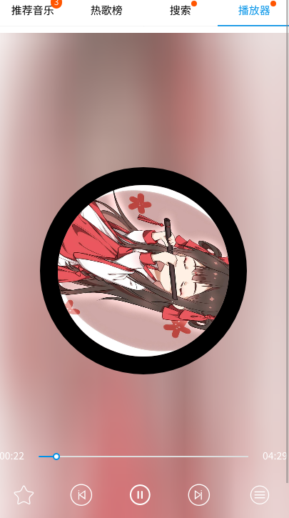
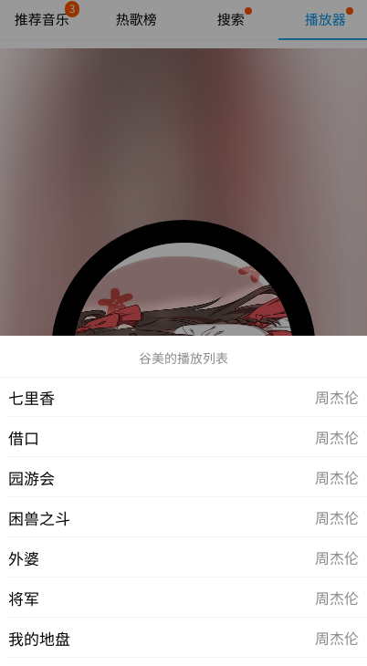

这个项目是利用react,redux,antd-mobile,以及一些中间件如react-redux,redux-logger,redux-thunk等
# 安装和使用
```git clone https://github.com/GUMEIK/react-music.git```
```npm install```
```npm start```
后端服务器采用的是```NeteaseCloudMusicApi```
# 项目截图
- 推荐音乐

- 热歌榜

- 热搜列表

- 音乐搜索

- 播放器界面

- 播放列表

# 总结
本项目实现了一个播放器该有的基本功能，作为一个练手项目，没有太注意代码规范，这也是后期要进行改进的方向之一.

除此之外，后期还会进行功能的逐步升级和完善